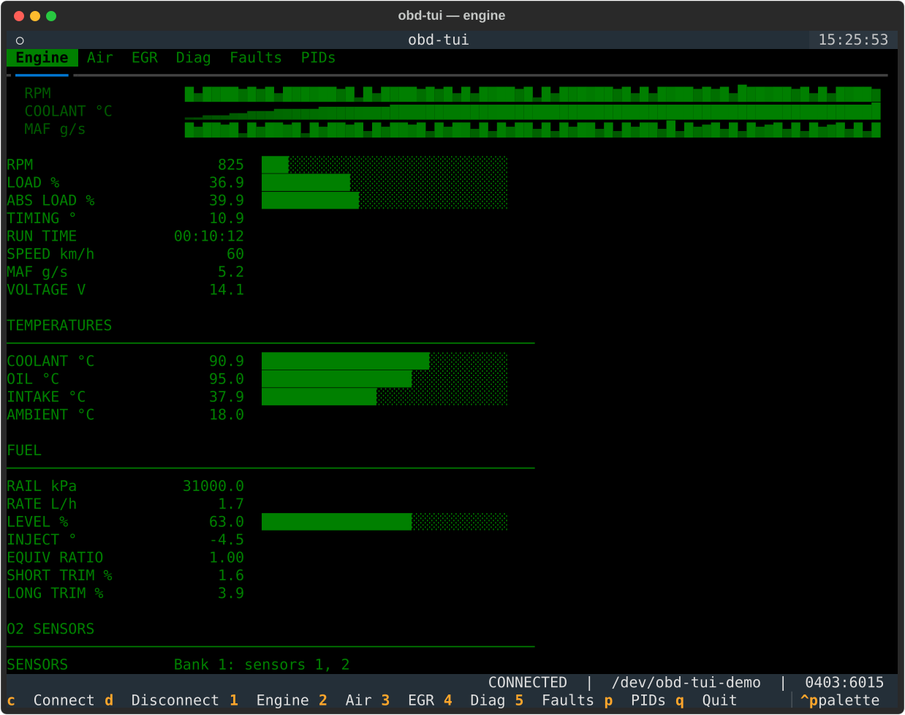

<h1 align="center">
  <br/>
  obd-tui
</h1>

<p align="center">
  <em>Terminal dashboard for real-time OBD-II vehicle diagnostics.</em>
</p>

<p align="center">
  <a href="https://github.com/goabonga/obd-tui/actions/workflows/ci.yml"></a>
  <a href="https://codecov.io/gh/goabonga/obd-tui"></a>
  <a href="https://pypi.org/project/obd-tui/"></a>
  <a href="https://github.com/goabonga/obd-tui/blob/main/LICENSE"></a>
  <a href="https://www.python.org/downloads/"></a>
  <a href="https://github.com/astral-sh/uv"></a>
</p>

`obd-tui` turns any ELM327-compatible OBD-II adapter into a live terminal
dashboard. It auto-detects the adapter on the serial bus, asks the vehicle
which commands it actually supports, and streams the readings into a tabbed
[Textual](https://textual.textualize.io/) UI — engine, turbo/air, EGR,
diagnostics, fault codes, and the full PID catalogue.



No adapter at hand? `obd-tui --demo` runs the whole dashboard against a
simulated vehicle.

## Documentation

The project site is published from `main` to GitHub Pages:
<https://goabonga.github.io/obd-tui/>.

## Requirements

- Python 3.11+
- An ELM327-compatible OBD-II adapter on a serial port (USB or Bluetooth RFCOMM)
- [uv](https://docs.astral.sh/uv/) for development

## Install

```bash
pip install obd-tui      # or: uvx obd-tui
```

On Ubuntu 24.04 LTS and 26.04 LTS, from the PPA:

```bash
sudo add-apt-repository ppa:goabonga/obd-tui
sudo apt install obd-tui
```

## Usage

```bash
obd-tui                       # launch the dashboard
obd-tui --port /dev/ttyUSB0   # skip auto-detection and connect at once
obd-tui --demo                # simulated vehicle, no hardware needed
obd-tui --record drive.jsonl  # log every sweep as JSON Lines
obd-tui --units imperial      # °F, mph, psi
obd-tui --version
```

Keys: `c` connect · `d` disconnect · `1`–`5` panels · `p` PID catalogue ·
`x` clear DTCs · `q` quit. Panels taller than the window scroll with the
wheel, the arrows or `PgUp`/`PgDn`.

## Features

- **Demo mode** — `--demo` drives the dashboard from a simulated vehicle,
  so the UI can be tried, screenshotted and tested with nothing plugged in.
- **Trends** — RPM, coolant and MAF are charted above the engine readings
  from a five-minute rolling history.
- **Recording** — `--record FILE` appends every sweep to a JSON Lines file,
  flushed as it goes, ready for `jq` or pandas.
- **Adapter auto-detection** — scans serial ports for known OBD-II adapters
  (vLinker / FTDI `0403:6015`, and any port whose product or manufacturer
  string looks like an OBD adapter), falls back to bound Bluetooth RFCOMM
  nodes, and takes `--port` to override.
- **Metric or imperial** — `--units imperial` for °F, mph and psi; only the
  display changes, recordings stay in the units the vehicle reports.
- **Configuration file** — port, units, sweep period and reconnect
  interval in `~/.config/obd-tui/config.toml`, overridden by the command
  line.
- **Clear DTCs** — `x` sends mode 04 after a confirmation dialog spelling
  out what it resets, then reads the codes back.
- **Adaptive polling** — readings are swept at three cadences, and whatever
  the open panel shows is read every sweep. A vehicle that stops answering
  is detected and the session drops to `LINK LOST` instead of hanging.
- **Capability discovery** — queries the vehicle for its supported commands
  across modes 01–09 plus the ELM adapter commands, so panels only show data
  the ECU can actually produce.
- **Tabbed dashboard** — Engine, Turbo/Air, EGR, Diagnostics, Faults and the
  PID catalogue, refreshed once per second while connected.
- **Reconnects on its own** — a missing adapter, a port that refused to
  open or a vehicle that went quiet is retried every few seconds, until
  `d` says the link is to stay down.
- **Live connection status** in the footer: state, port, and adapter VID:PID.
- Tabs stay disabled until a device is connected, and disable again on
  disconnect.

## Getting started (development)

```bash
git clone https://github.com/goabonga/obd-tui.git
cd obd-tui
uv sync
uv run pre-commit install
uv run ruff check src tests
uv run mypy src
uv run pytest
```

## Versioning and release

Versions are bumped from
[Conventional Commits](https://www.conventionalcommits.org/) by
[multicz](https://github.com/goabonga/multicz). On every push to `main`, CI
computes the bump, writes the changelog, tags, and publishes the wheel to PyPI
through Trusted Publishing. Maintainers do not bump versions or edit the
changelog by hand.

## Stability and deprecation policy

`obd-tui` follows [Semantic Versioning](https://semver.org/) and the standard
Python `n + 2` deprecation cadence (announce + warn in one release, remove in
the release after the next). Full policy:
[`docs/stability.md`](docs/stability.md).

## Contributing

See [CONTRIBUTING.md](CONTRIBUTING.md) for the workflow, the commit-message
convention, and the test/lint expectations. By participating you agree to the
[Code of Conduct](CODE_OF_CONDUCT.md).

Security issues: please follow the disclosure process in
[SECURITY.md](SECURITY.md).

## License

Distributed under the [MIT License](LICENSE).
