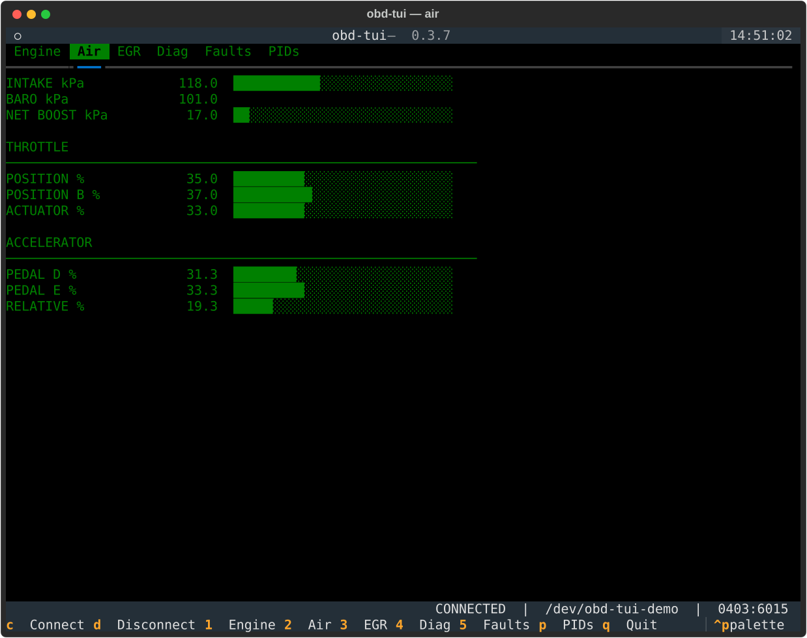
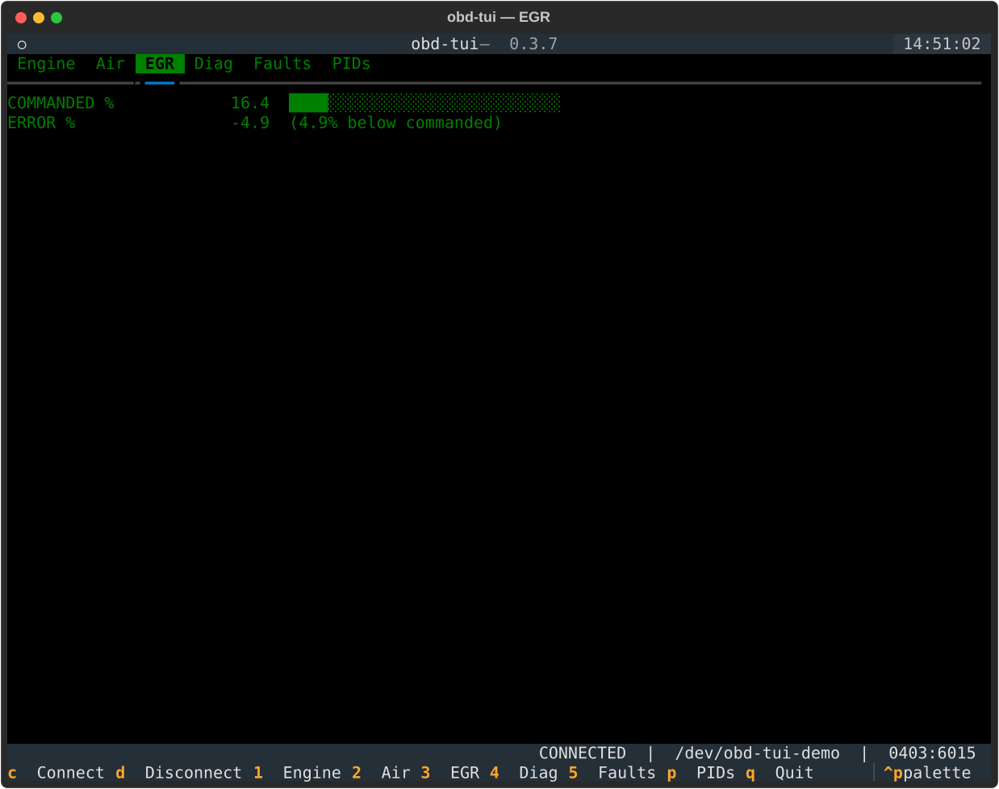
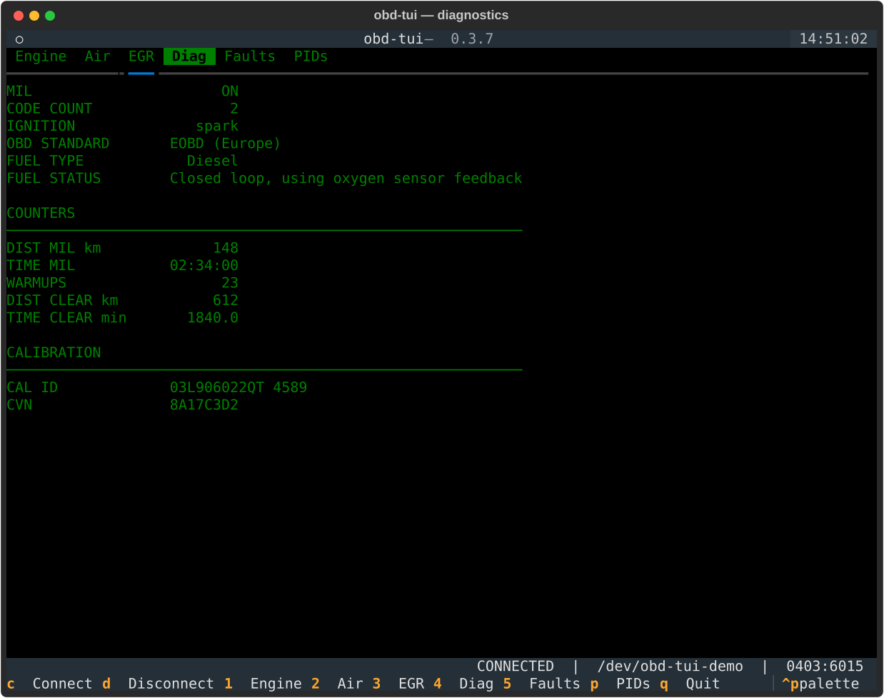
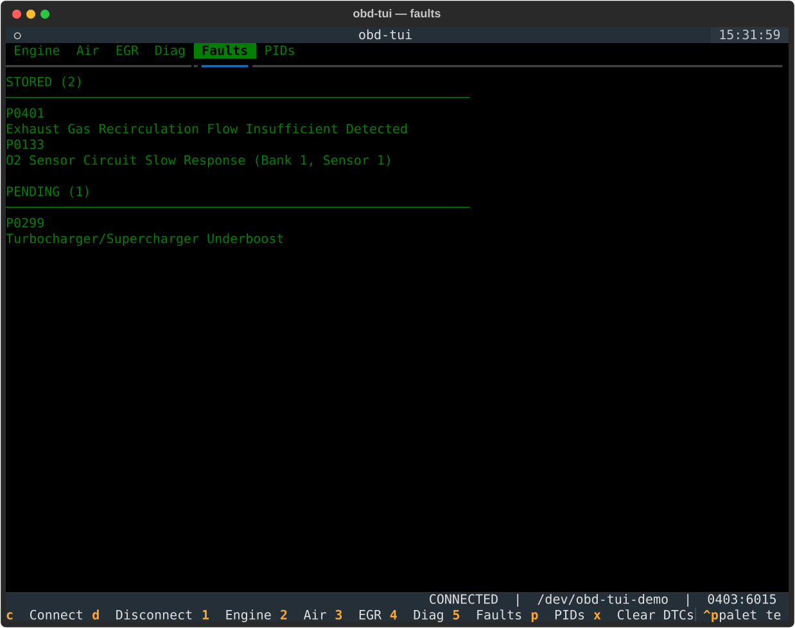
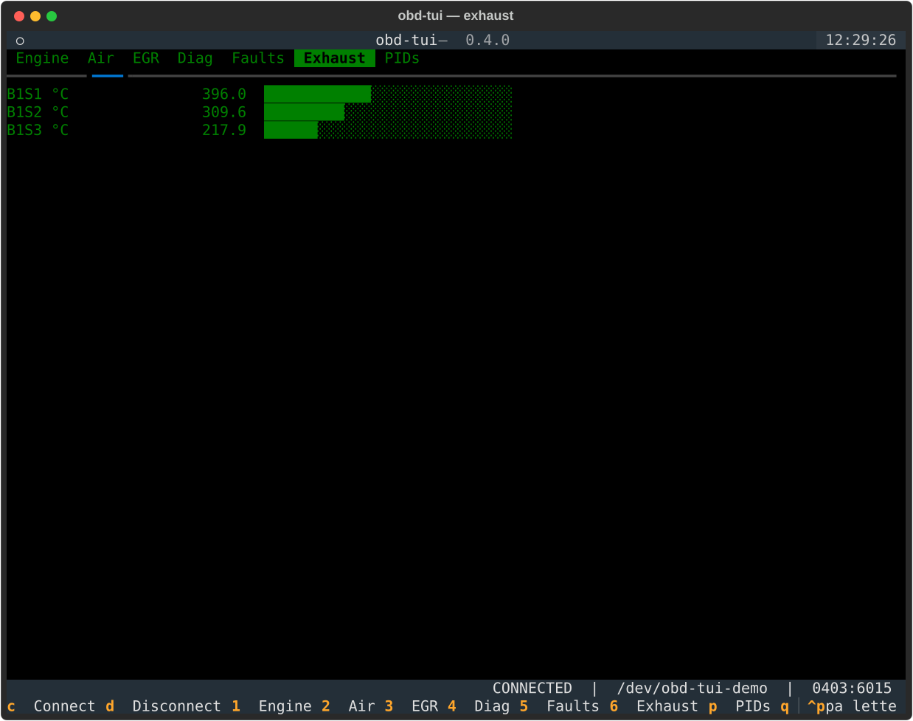
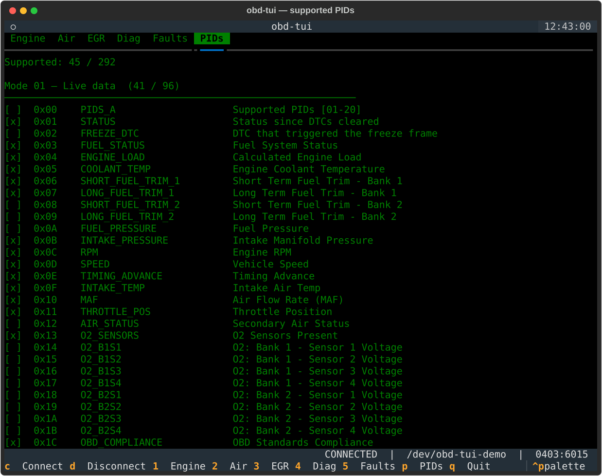

# Panels

Seven tabs, each a pure rendering of the latest readings.

## Engine (`1`)

Rotation and load first - RPM, calculated and absolute load, ignition
timing advance, engine run time, vehicle speed, mass air flow and control
module voltage - then three sections that appear only if the vehicle
answers them:

- **Temperatures** - coolant, oil, intake air, ambient air.
- **Fuel** - rail pressure, consumption rate, tank level, injection timing,
  commanded equivalence ratio, and the short and long term fuel trims of
  bank 1.
- **O2 sensors** - the sensor layout reported by the ECU and the wide-range
  lambda readings of sensors 1 and 2.

Gauges are scaled to plausible full-scale values (7000 rpm, 130 °C coolant,
150 °C oil), so a bar near the end means near the limit rather than near
the largest value seen so far.


## Air (`2`)

The intake path: absolute manifold pressure, barometric pressure, and the
**net boost** derived from the two.

Net boost is manifold pressure minus ambient, so it is only shown once both
readings exist. It is gauged only when positive - below ambient the engine
is under vacuum, which is normal off-boost and is labelled `(vacuum)`
instead of drawing a bar.

Then throttle position (primary, secondary and the commanded actuator) and
accelerator pedal position (D, E and relative).



## EGR (`3`)

Commanded exhaust gas recirculation rate, and the error between commanded
and actual. The sign of that error is easy to read backwards, so it is
spelled out: `(4.5% below commanded)`, `(2.0% above commanded)`, or
`(on target)`.



## Diagnostics (`4`)

The malfunction indicator lamp, the stored code count and the ignition type
read from the ECU status word, followed by the OBD standard the vehicle
complies with, its fuel type and current fuel system status. Then:

- **Counters** - distance and run time with the MIL on, warm-ups since the
  codes were cleared, and distance and time since that clear.
- **Calibration** - calibration id and calibration verification number.



## Faults (`5`)

Diagnostic trouble codes, split into the ones the ECU has **stored** and
the **pending** ones it has seen but not yet confirmed, each with its
description when the vehicle provides one. A vehicle with nothing to report
says `No trouble code stored`.



## Exhaust (`6`)

The exhaust gas temperatures, one row per sensor fitted, bank by bank and
upstream first, named the way a trouble code names them: `B1S2` is bank 1
sensor 2. `B1S1` sits before the turbine on most diesels, the last sensor
of a bank past the particulate filter. Up to four sensors per bank and up
to two banks, from mode 01 PIDs `0x78` and `0x79`, each answering a whole
bank at once; a bank the vehicle does not answer, or a sensor it reports
as not fitted, never appears. Nothing on the panel assumes how many of
either there are:

```
  B1S1 °C            396.0  ████████████░░░░░░░░░░░░░░░░
  B1S2 °C            309.6  █████████░░░░░░░░░░░░░░░░░░░
  B1S3 °C            217.9  ██████░░░░░░░░░░░░░░░░░░░░░░
  B2S1 °C            402.3  ████████████░░░░░░░░░░░░░░░░
```



Gauges run to 900 °C, so a particulate filter regeneration at 600 °C
reads as hot rather than pegged.

A sensor sitting more than 300 °C from the median of all the others gets a note,
`⚠ far from the other sensors`. That is a hint, not a diagnosis: under
load a healthy exhaust spreads a couple of hundred degrees between the
turbine and the filter, while a sensor whose circuit has failed reads one
end of the scale - a thousand degrees from its neighbours on a cold engine.
With only two sensors the note lands on both, since the panel cannot tell
which one is wrong. See [Diagnosing faults](diagnosing.md#exhaust-gas-temperature-sensors)
for how to read it, and what usually fixes it.

Whether the panel has anything to show depends on the ECU: both PIDs are
optional, and a vehicle that does not name one in its supported-PID bitmap
is never asked for it. The [PID catalogue](#pid-catalogue-p) lists
`EGT_BANK_1` and `EGT_BANK_2` with what this one did. A manufacturer that
reads a bank some other way can fill in through its profile, and the panel
does not know the difference.

## PID catalogue (`p`)

Every command `obd-tui` knows about, grouped by OBD-II mode, with `[x]` for
the ones this vehicle supports and `[ ]` for the rest, plus the count per
mode and overall. The last group covers the commands answered by the
adapter itself rather than by the ECU.



This is the list the poller works from: only supported commands are
queried, because sweeping every known PID takes seconds on a real adapter.
